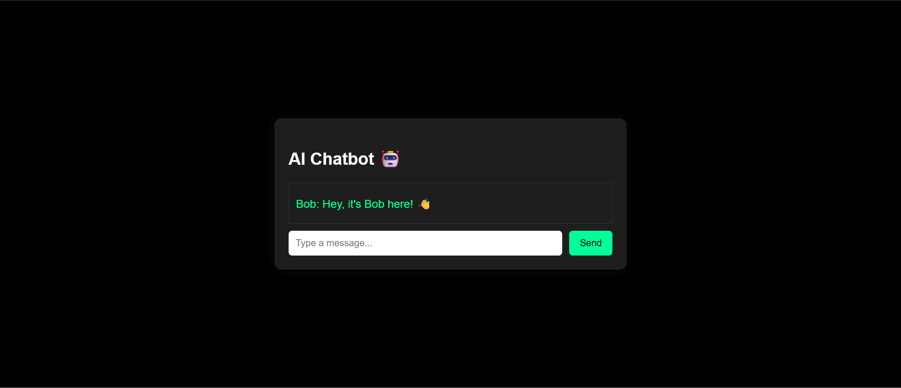

# 🤖 AI Chatbot Web App

> A full-stack AI chatbot web application that lets users interact with an intelligent assistant in real time. Built with a responsive and sleek front-end, and powered by a smart backend — this app replicates the feel of modern AI chat platforms like ChatGPT.

---

---

## ✨ Features

- 💬 Real-time chatbot conversation UI
- 🤖 AI-powered responses (using mock/demo API or real LLM integration)
- 🎨 Clean and modern design inspired by chat apps
- 🌙 Light/Dark theme support (if implemented)
- 📱 Mobile responsive and smooth UX
- 📜 Conversation history display (optional feature)

---

## 🛠 Tech Stack

- **Frontend**: HTML, CSS, JavaScript *(or React if used)*
- **Backend**: Node.js / Python Flask *(if applicable)*
- **API/LLM**: OpenAI GPT / any other language model API *(mocked or real)*
- **Tools**: Git, GitHub, VS Code

---

## 🧠 How It Works

- Users enter a message into the chat window  
- The input is sent to an AI API (or placeholder function)  
- The AI's response is displayed dynamically in the chat thread  
- Seamless scrolling, typing indicator, and chat bubbles enhance the UX

---

## 💡 Purpose

This project was built to:
- Explore AI-based app development
- Practice frontend + backend integration
- Understand chatbot UX patterns
- Learn API calls and dynamic data rendering

---

## 📸 Preview

---

## 🚧 Future Enhancements

- 🗃️ Save conversation history
- 🧠 Integrate real GPT-4 API or LLM endpoint
- 🔐 Add user authentication
- 🖼️ Add avatar and custom profile support
- 🌐 Multilingual support

---

## 📬 Connect with Me

📧 malikdevanshi22@gmail.com  
🔗 [GitHub](https://github.com/DevanshiSingh22) 

---

⭐ If you liked this project, **star** the repository and show your support!
